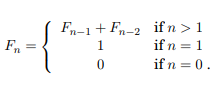

# Prologue

Look around you. Computers and networks are everywhere, enabling an intricate web of complex human activities: education, commerce, entertainment, research, manufacturing, health management, human communication, even war. Of the two main technological underpinnings of this amazing proliferation, one is obvious: the breathtaking pace with which advances in microelectronics and chip design have been bringing us faster and faster hardware.

This book tells the story of the other intellectual enterprise that is crucially fueling the computer revolution: *efficient algorithms*. It is a fascinating story.

*Gather ’round and listen close.*

## 0.1 Books and algorithms

Two ideas changed the world. In 1448 in the German city of Mainz a goldsmith named Johann Gutenberg discovered a way to print books by putting together movable metallic pieces. Literacy spread, the Dark Ages ended, the human intellect was liberated, science and technology triumphed, the Industrial Revolution happened. Many historians say we owe all this to typography. Imagine a world in which only an elite could read these lines! But others insist that the key development was not typography, but *algorithms*.

Today we are so used to writing numbers in decimal, that it is easy to forget that Gutenberg would write the number 1448 as MCDXLVIII. How do you add two Roman numerals? What is MCDXLVIII + DCCCXII? (And just try to think about multiplying them.) Even a clever man like Gutenberg probably only knew how to add and subtract small numbers using his fingers; for anything more complicated he had to consult an abacus specialist.

The decimal system, invented in India around AD 600, was a revolution in quantitative reasoning: using only 10 symbols, even very large numbers could be written down compactly, and arithmetic could be done efficiently on them by following elementary steps. Nonetheless these ideas took a long time to spread, hindered by traditional barriers of language, distance, and ignorance. The most influential medium of transmission turned out to be a textbook, written in Arabic in the ninth century by a man who lived in Baghdad. Al Khwarizmi laid out the basic methods for adding, multiplying, and dividing numbers—even extracting square roots and calculating digits of π. These procedures were precise, unambiguous mechanical, efficient, correct—in short, they were algorithms, a term coined to honor the wise man after
the decimal system was finally adopted in Europe, many centuries later.

Since then, this decimal positional system and its numerical algorithms have played an enormous role in Western civilization. They enabled science and technology; they accelerated industry and commerce. And when, much later, the computer was finally designed, it explicitly embodied the positional system in its bits and words and arithmetic unit. Scientists everywhere then got busy developing more and more complex algorithms for all kinds of problems and inventing novel applications—ultimately changing the world.

## 0.2 Enter Fibonacci

Al Khwarizmi’s work could not have gained a foothold in the West were it not for the efforts of one man: 15th century Italian mathematician Leonardo Fibonacci, who saw the potential of the positional system  worked hard to develop it further and propagandize it. But today Fibonacci is most widely known for his famous sequence of numbers

```numbers
0, 1, 1, 2, 3, 5, 8, 13, 21, 34, ... ,
```

each the sum of its two immediate predecessors. More formally, the Fibonacci numbers Fn are generated by the simple rule.



No other sequence of numbers has been studied as extensively, or applied to more fields: biology, demography, art, architecture, music, to name just a few. And, together with the powers of 2, it is computer science’s favorite sequence.

In fact, the Fibonacci numbers grow almost as fast as the powers of 2: for example, F30 is over a million, and F100 is already 21 digits long! In general, Fn ≈ 2^0.694n (see Exercise 0.3).

But what is the precise value of F100, or of F200? Fibonacci himself would surely have wanted to know such things. To answer, we need an algorithm for computing the nth Fibonacci number.

### An exponential algorithm

One idea is to slavishly implement the recursive definition of Fn. Here is the resulting algorithm, in the “pseudocode” notation used throughout this book:

```pc
function fib1(n)
if n = 0: return 0
if n = 1: return 1
return fib1(n − 1) + fib1(n − 2)
```

Whenever we have an algorithm, there are three questions we always ask about it:

1. Is it correct?
2. How much time does it take, as a function of n?
3. And can we do better?

The first question is moot here, as this algorithm is precisely Fibonacci’s definition of Fn. But the second demands an answer. Let T(n) be the number of computer steps needed to compute fib1(n); what can we say about this function? For starters, if n is less than 2, the procedure halts almost immediately, after just a couple of steps. Therefore,

```math
T(n) ≤ 2 for n ≤ 1.
```

For larger values of n, there are two recursive invocations of fib1, taking time T(n − 1) and T(n−2), respectively, plus three computer steps (checks on the value of n and a final addition). Therefore,

```math
T(n) = T(n − 1) + T(n − 2) + 3 for n > 1
```
