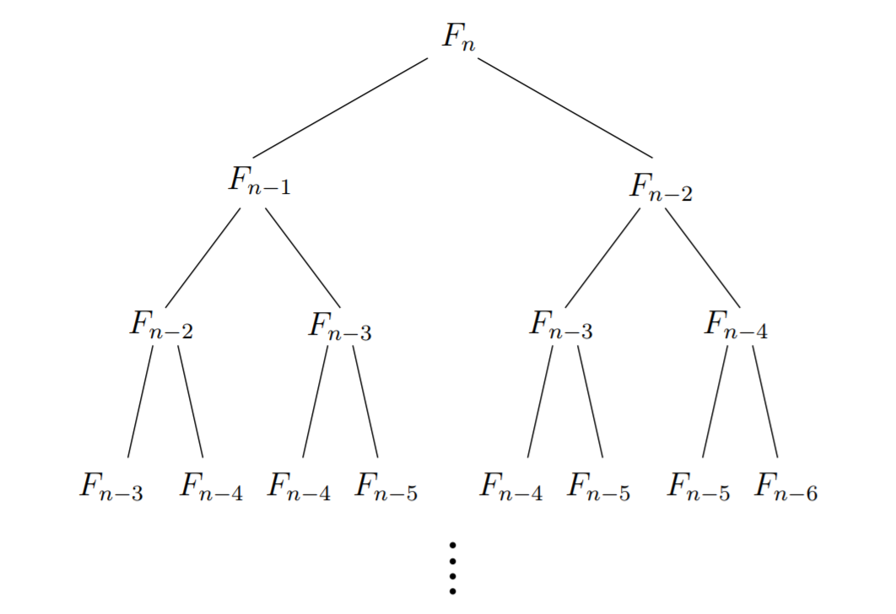

# Prologue

Look around you. Computers and networks are everywhere, enabling an intricate web of complex human activities: education, commerce, entertainment, research, manufacturing, health management, human communication, even war. Of the two main technological underpinnings of this amazing proliferation, one is obvious: the breathtaking pace with which advances in microelectronics and chip design have been bringing us faster and faster hardware.

This book tells the story of the other intellectual enterprise that is crucially fueling the computer revolution: *efficient algorithms*. It is a fascinating story.

*Gather ’round and listen close.*

## 0.1 Books and algorithms

Two ideas changed the world. In 1448 in the German city of Mainz a goldsmith named Johann Gutenberg discovered a way to print books by putting together movable metallic pieces. Literacy spread, the Dark Ages ended, the human intellect was liberated, science and technology triumphed, the Industrial Revolution happened. Many historians say we owe all this to typography. Imagine a world in which only an elite could read these lines! But others insist that the key development was not typography, but *algorithms*.

Today we are so used to writing numbers in decimal, that it is easy to forget that Gutenberg would write the number 1448 as MCDXLVIII. How do you add two Roman numerals? What is MCDXLVIII + DCCCXII? (And just try to think about multiplying them.) Even a clever man like Gutenberg probably only knew how to add and subtract small numbers using his fingers; for anything more complicated he had to consult an abacus specialist.

The decimal system, invented in India around AD 600, was a revolution in quantitative reasoning: using only 10 symbols, even very large numbers could be written down compactly, and arithmetic could be done efficiently on them by following elementary steps. Nonetheless these ideas took a long time to spread, hindered by traditional barriers of language, distance, and ignorance. The most influential medium of transmission turned out to be a textbook, written in Arabic in the ninth century by a man who lived in Baghdad. Al Khwarizmi laid out the basic methods for adding, multiplying, and dividing numbers—even extracting square roots and calculating digits of π. These procedures were precise, unambiguous mechanical, efficient, correct—in short, they were algorithms, a term coined to honor the wise man after
the decimal system was finally adopted in Europe, many centuries later.

Since then, this decimal positional system and its numerical algorithms have played an enormous role in Western civilization. They enabled science and technology; they accelerated industry and commerce. And when, much later, the computer was finally designed, it explicitly embodied the positional system in its bits and words and arithmetic unit. Scientists everywhere then got busy developing more and more complex algorithms for all kinds of problems and inventing novel applications—ultimately changing the world.

## 0.2 Enter Fibonacci

Al Khwarizmi’s work could not have gained a foothold in the West were it not for the efforts of one man: 15th century Italian mathematician Leonardo Fibonacci, who saw the potential of the positional system  worked hard to develop it further and propagandize it. But today Fibonacci is most widely known for his famous sequence of numbers

```numbers
0, 1, 1, 2, 3, 5, 8, 13, 21, 34, ... ,
```

each the sum of its two immediate predecessors. More formally, the Fibonacci numbers Fn are generated by the simple rule.


No other sequence of numbers has been studied as extensively, or applied to more fields: biology, demography, art, architecture, music, to name just a few. And, together with the powers of 2, it is computer science’s favorite sequence.

In fact, the Fibonacci numbers grow almost as fast as the powers of 2: for example, F30 is over a million, and F100 is already 21 digits long! In general, Fn ≈ 2^0.694n (see Exercise 0.3).

But what is the precise value of F100, or of F200? Fibonacci himself would surely have wanted to know such things. To answer, we need an algorithm for computing the nth Fibonacci number.

### An exponential algorithm

One idea is to slavishly implement the recursive definition of Fn. Here is the resulting algorithm, in the “pseudocode” notation used throughout this book:

```pc
function fib1(n)
if n = 0: return 0
if n = 1: return 1
return fib1(n − 1) + fib1(n − 2)
```

Whenever we have an algorithm, there are three questions we always ask about it:

1. Is it correct?
2. How much time does it take, as a function of n?
3. And can we do better?

The first question is moot here, as this algorithm is precisely Fibonacci’s definition of Fn. But the second demands an answer. Let T(n) be the number of computer steps needed to compute fib1(n); what can we say about this function? For starters, if n is less than 2, the procedure halts almost immediately, after just a couple of steps. Therefore,

```math
T(n) ≤ 2 for n ≤ 1.
```

For larger values of n, there are two recursive invocations of fib1, taking time T(n − 1) and T(n−2), respectively, plus three computer steps (checks on the value of n and a final addition). Therefore,

```math
T(n) = T(n − 1) + T(n − 2) + 3 for n > 1
```

Compare this to the recurrence relation for Fn: we immediately see that T(n) ≥ Fn.

This is very bad news: the running time of the algorithm grows as fast as the Fibonacci numbers! T(n) is *exponential* in n, which implies that the algorithm is impractically slow except for very small values of n.

Let’s be a little more concrete about just how bad exponential time is. To compute F200, the fib1 algorithm executes T(200) ≥ F200 ≥ 2^138 elementary computer steps. How long this actually takes depends, of course, on the computer used. At this time, the fastest computer in the world is the NEC Earth Simulator, which clocks 40 trillion steps per second. Even on this machine, fib1(200) would take at least 2^92 seconds. This means that, if we start the computation today, it would still be going long after the sun turns into a red giant star.

But technology is rapidly improving—computer speeds have been doubling roughly every 18 months, a phenomenon sometimes called *Moore’s law*. With this extraordinary growth, perhaps fib1 will run a lot faster on next year’s machines. Let’s see — the running time of fib1(n) is proportional to 2^0.694n ≈ (1.6)n, so it takes 1.6 times longer to compute Fn+1 than Fn. And under Moore’s law, computers get roughly 1.6 times faster each year. So if we can reasonably compute F100 with this year’s technology, then next year we will manage F101. And the year after, F102. And so on: just one more Fibonacci number every year! Such is the curse
of exponential time.

In short, our naive recursive algorithm is correct but hopelessly inefficient. *Can we do better?*

### A polynomial algorithm

Let’s try to understand why fib1 is so slow. Figure 0.1 shows the cascade of recursive invocations triggered by a single call to fib1(n). Notice that many computations are repeated!

A more sensible scheme would store the intermediate results—the values F0, F1, . . . , Fn−1 — as soon as they become known.



```pc
function fib2(n)
if n = 0 return 0
create an array f[0 . . . n]
f[0] = 0, f[1] = 1
for i = 2 . . . n:
f[i] = f[i − 1] + f[i − 2]
return f[n
```

As with fib1, the correctness of this algorithm is self-evident because it directly uses the definition of Fn. How long does it take? The inner loop consists of a single computer step and is executed n − 1 times. Therefore the number of computer steps used by fib2 is linear in n. From exponential we are down to polynomial, a huge breakthrough in running time. It is now perfectly reasonable to compute F200 or even F200,000.

As we will see repeatedly throughout this book, the right algorithm makes all the difference.

### More careful analysi

In our discussion so far, we have been counting the number of basic computer steps executed by each algorithm and thinking of these basic steps as taking a constant amount of time. This is a very useful simplification. After all, a processor’s instruction set has a variety of basic primitives—branching, storing to memory, comparing numbers, simple arithmetic, an so on—and rather than distinguishing between these elementary operations, it is far more convenient to lump them together into one category.

But looking back at our treatment of Fibonacci algorithms, we have been too liberal with what we consider a basic step. It is reasonable to treat addition as a single computer step if small numbers are being added, 32-bit numbers say. But the nth Fibonacci number is about 0.694n bits long, and this can far exceed 32 as n grows. Arithmetic operations on arbitrarily large numbers cannot possibly be performed in a single, constant-time step. We need to audit our earlier running time estimates and make them more honest.

We will see in Chapter 1 that the addition of two n-bit numbers takes time roughly proportional to n; this is not too hard to understand if you think back to the grade-school procedure for addition, which works on one digit at a time. Thus fib1, which performs about Fn additions, actually uses a number of basic steps roughly proportional to nFn. Likewise, the number of steps taken by fib2 is proportional to n^2, still polynomial in n and therefore exponentially superior to fib1. This correction to the running time analysis does not diminish our breakthrough.

*But can we do even better than fib2?* Indeed we can: see Exercise 0.4.

## 0.3 Big-O notation

We’ve just seen how sloppiness in the analysis of running times can lead to an unacceptable level of inaccuracy in the result. But the opposite danger is also present: it is possible to be too precise. An insightful analysis is based on the right simplifications.

Expressing running time in terms of basic computer steps is already a simplification. After all, the time taken by one such step depends crucially on the particular processor and even on details such as caching strategy (as a result of which the running time can differ subtly from one execution to the next). Accounting for these architecture-specific minutiae is a nightmarishly complex task and yields a result that does not generalize from one computer to the next. It therefore makes more sense to seek an uncluttered, machine-independent characterization of an algorithm’s efficiency. To this end, we will always express running time by counting the number of basic computer steps, as a function of the size of the input. 

And this simplification leads to another. Instead of reporting that an algorithm takes, say, 5n 3 + 4n + 3 steps on an input of size n, it is much simpler to leave out lower-order terms such as 4n and 3 (which become insignificant as n grows), and even the detail of the coefficient 5 in the leading term (computers will be five times faster in a few years anyway), and just say that the algorithm takes time O(n3) (pronounced “big oh of n3”). 

It is time to define this notation precisely. In what follows, think of f(n) and g(n) as the running times of two algorithms on inputs of size n.

Let f(n) and g(n) be functions from positive integers to positive reals. We say f = O(g) (which means that “f grows no faster than g”) if there is a constant c > 0 such that f(n) ≤ c · g(n).
